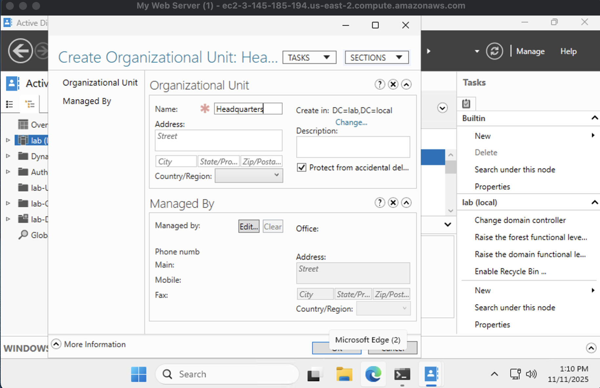

# active-directory-lab
Creating Organizational Units, Groups and Users in Active Directory
Active Directory Lab - lab.local

Overview:
This project demonstrates the setup and configuration of a complete Active Directory Domain Services (AD DS) environment on Windows Server using primarily the graphical user interface (GUI). The goal of the lab is to simulate a small business network by creating a new domain, organizational units (OUs), users, and groups, and verifying access control and domain structure through Active Directory Users and Computers (ADUC).

Lab Environment:
Operating System: Windows Server 2019
Domain Name: lab.local
Server Role: Primary Domain Controller (DC01)
Installed Services: Active Directory Domain Services (AD DS), DNS
Management Tools: Server Manager, Active Directory Users and Computers (ADUC)
Installation Method: GUI (except for AD DS role installation via PowerShell)

Step 1 - Install Active Directory Domain Services:
Installed the Active Directory Domain Services role through PowerShell using the following command:

Install-WindowsFeature -Name AD-Domain-Services -IncludeManagementTools

After installation, used Server Manager to promote the server to a domain controller and created a new forest named lab.local. The server rebooted automatically after configuration.

Step 2 - Create Organizational Units (OUs):
Using Active Directory Users and Computers (ADUC), created three primary organizational units to represent departments within a company:

Headquarters

Sales

IT

Screenshots included:

Step 3 - Create User Account:
Created a new user named "Oscar" within the IT organizational unit using the GUI wizard in ADUC.
Set up login credentials and verified that the account appeared under the IT OU.

Screenshot included:

User "Oscar" successfully created in the IT OU

Step 4 - Create Security Group:
Created a new global security group named "IT Admins" under the IT organizational unit using ADUC.
Added the user "Oscar" to both the IT OU and the IT Admins group to simulate administrative access.

Screenshots included:

IT Admins group creation window

Group membership list showing Oscar as a member of both IT and IT Admins

Step 5 - Verification:
Used the ADUC interface to verify:

All organizational units were created successfully

The Oscar user account existed under the IT OU

The IT Admins group contained the Oscar account as a member

Confirmed that the domain structure and group relationships were functioning as expected.

Summary of Completed Tasks:
Installed and configured Active Directory Domain Services: Complete
Created new forest and domain lab.local: Complete
Created Headquarters, Sales, and IT organizational units: Complete
Created user "Oscar" under IT OU: Complete
Created IT Admins security group: Complete
Added Oscar to IT and IT Admins groups: Complete
Verified structure and membership through GUI: Complete
Collected screenshots for documentation: Complete

Skills Demonstrated:
Installing Active Directory Domain Services
Using Server Manager and ADUC for configuration
Creating and organizing OUs within a domain
Managing users and groups through the GUI
